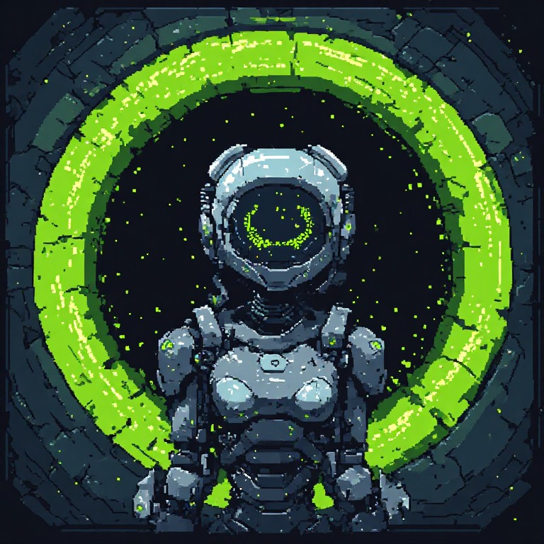
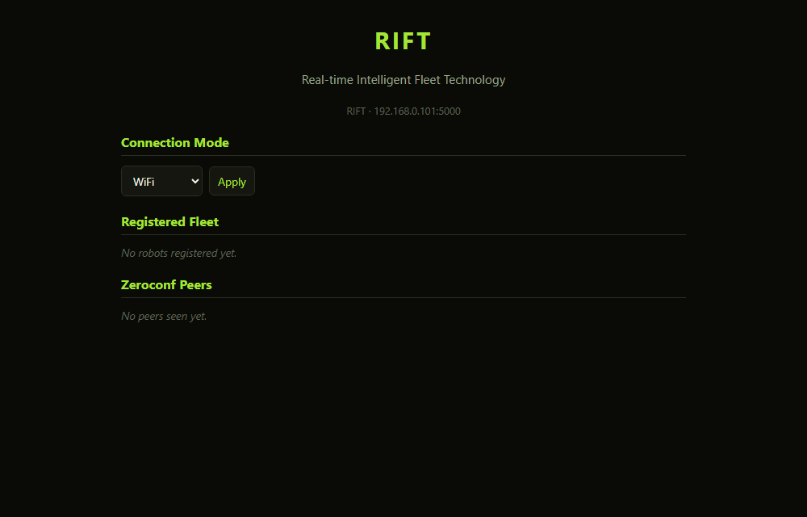

[](https://x.com/NorowaretaGemu)
[](https://opensource.org/licenses/MIT)

<div align="center">
  <a href="https://ko-fi.com/cursedentertainment">
    
  </a>
</div>

<div align="center">
  
  
  
  
  
  
  
  
</div>

<div align="center">
  
  
  
  
  
</div>

<div align="center">
  
  
  
  
</div>

---

# RIFT
## Real-time Intelligent Fleet Technology
### A DREAM Robotics System

<div align="center">
  
  <p><i>RIFT</i></p>
</div>

## Related Projects (DREAM Robotics Ecosystem)

- [KIDA-Robot-v00](https://github.com/CursedPrograms/KIDA-Robot-v00)
- [KIDA-Robot-v01](https://github.com/CursedPrograms/KIDA-Robot-v01)
- [MILA-Robot-v00](https://github.com/CursedPrograms/MILA-Robot-v00)
- [NORA-Robot-v00](https://github.com/CursedPrograms/NORA-Robot-v00)
- [WHIP-Robot-v00](https://github.com/CursedPrograms/WHIP-Robot-v00)
- [DREAM](https://github.com/CursedPrograms/DREAM)
- [ARM-Robot-v01](https://github.com/CursedPrograms/ARM-Robot-v01)

---

## 📖 Overview

<details>
<summary><b>View Overview</b></summary>

RIFT is the centralized command-and-control backbone of the DREAM robotics ecosystem. Built with Python and Flask, it serves as a high-speed telemetry hub that bridges the gap between various hardware platforms—like WHIP, NORA, and KIDA—and the user interface. By utilizing a unified communication protocol, RIFT allows for seamless fleet management and synchronized multi-agent operations.

Core Features
- [x] Fleet Dashboard: Real-time monitoring and control of multiple robots from a single interface.
- [x] Protocol Bridging: Seamlessly translates commands between PC, Android, and diverse microcontroller platforms.
- [x] Autoconnect Hub: Logic-based routing for local and remote instances (localhost:5000 through 5006).
- [x] Telemetry Visualization: Live data streaming from IMU (MPU6050) and Ultrasonic sensors across the fleet.

#### ESP32/Wi-Fi Network Communications:
This system uses [NORA-Robot-v00](https://github.com/CursedPrograms/NORA-Robot-v00)
 as a central hub, while human devices like phones and PCs act as control interfaces. [DREAM](https://github.com/CursedPrograms/DREAM) can also assist with verbal communication between users and robots.

#### Supported Development & Runtime Environments
- Microcontrollers: ESP32, Arduino IDE
- PC & Mobile Apps: Android Studio, MinGW (Windows/Linux)
- Operating Systems: Raspberry Pi OS, Ubuntu, Windows, Android
</details>

```bash
RIFT: :5000
DREAM: :5001 (her own site - DREAM on your phone)
DREAM:     :5009 (DREAM's dashboard and API, HTTPS)
NORA: :5002
KIDA-00: :5003
KIDA-01: :5004
WHIP: :5005
MILA: :5010
ARM: :5011
```

## ▶️ Starting RIFT
`run.bat` starts the **Python hub** (`app.py`): it sets up `venv\` and installs `requirements.txt` the first time (again only when that file changes). That's the one with the conversations and the mission log. `run_server.bat` starts the native C++ hub instead (and the Go, Rust, Julia and F# hubs have their own `run_server_*.bat`); they share the same dashboard but only have the fleet registry, so the Conversations and Mission Log sections stay hidden there.

## 💬 Conversations (in Brainfuck)
RIFT has the robots chat: every 25–60 s it picks two that can talk and has the first say a phrase and the second answer. Every phrase is a **Brainfuck program that prints its words** (hello is `++++++++[>+++++++++++++<-]>.+.` → `hi`), and a robot says it by beeping the program on its buzzer, one tone per symbol, in its own voice.

- **Phrasebook:** `Fleet/brainfuck_talk.py` builds the shortest program it can for each phrase (0–6: hello, how are you, happy, curious, sleepy, let's play, bye) and reply (7–13), checks each with an interpreter, and writes the same `talk_bf.h` into every robot's sketch plus `Fleet/talk_bf.json`. Edit `PHRASES` and rerun it to change what they say.
- **Who talks:** robots that register a `talk:<port>` capability (with RIFT or NORA) and NORA herself; RIFT asks them with `GET /chirp?u=<0-13>`.
- **Personalities and moods:** each robot has its own chattiness and favourite phrases (`Fleet/conversations.py`), and a mood that drifts with the time of day and how its chats go - bright robots suggest playing, sleepy ones yawn.
- **Log:** `GET /talk` returns the shared conversation log and moods (NORA's IR chats with IDA are merged in); `POST /talk` starts one now. The dashboard's **Conversations** section shows who said what, the program and what it prints.

## 📜 Mission log and the fleet page
- **Fleet:** the dashboard lists every robot online - RIFT's own registry, NORA's (where most robots register) and NORA herself - each with an **Open** button for its own web page. The address comes from a `web:<port>` capability if the robot registers one, else its usual port (NORA 5002, KIDA00 5003, KIDA01 5004, WHIP 5005, DREAM 5009 over HTTPS, MILA 5010, ARM 5011). `GET /fleet` returns the same list as JSON.
- **Mission log:** RIFT keeps the fleet's diary (`Fleet/mission.py`): who came online or went quiet, who said what to whom, whose mood changed, counted in mission days from the first entry. It's saved to `mission_log.json`, so the mission carries on across restarts. `GET /mission` returns it; a robot can write its own entry with `POST /mission {"who": "DREAM", "text": "..."}`.

## 📡 RIFT's own board (IR + buzzer)

An Arduino UNO on the hub PC ([`arduino/rift_link`](arduino/rift_link/rift_link.ino)) gives RIFT what NORA has: an IR transmitter to drive and greet IDA, MILA, WHIP and KIDA-01 over the fleet IR link, an IR receiver that reports every frame it hears (NORA's "I am here" beacon, the robots' phrases, any remote), and a buzzer that speaks the Brainfuck phrases in the hub's own low voice.

| Part | UNO pin |
| :--- | :--- |
| IR LED (940 nm), via 100 Ω (or an NPN transistor for range) | 3 |
| IR receiver OUT (VS1838B / TSOP38238, 5 V) | 2 |
| Passive buzzer | 8 |

RIFT finds the board by the fleet handshake (`WHO` → `I am Rift`), 25 s after it starts and only on ports nobody else has open, so it never steals ARM's or DREAM's board. Without the board everything below just answers `503`.

- `GET /board`: connected or not, its port, the last IR frames heard
- `GET /board/link?r=ida&c=fw`: drive a robot (`fw bw left right stop auto manual speed`)
- `GET /board/say?r=mila&p=0`: beep a phrase (0-6), then send it to that robot over IR
- `GET /board/talk?u=7`: beep a Brainfuck utterance (0-13)

## How to Run:

<details>
<summary><b>View How to Run</b></summary>

### Environment Setup/Install Dependencies

```bash
sudo snap install android-studio --classic
python3 -m venv venv
source venv/bin/activate
pip install --upgrade pip
pip install -r requirements.txt
```
### Run app.py for the Flask fleet dashboard

Runs the fleet registry, mDNS discovery (including browsing for DREAM),
and the RIFT/NORA integration threads (fleet-authority heartbeat, internet
share) all in one Python process — no compiling required.

```bash
python app.py
```

This is a full alternative to the native fleet server below: both speak the
same `/robots` + `/register` protocol on port 5000, so run one or the other,
not both, on a given machine.

## ⚙️ Compile (native alternative)

### 🐧 Linux (`PC App/App`)

`network-discovery.cpp` is RIFT's native fleet-registry server: it publishes
itself on the LAN via mDNS/Avahi (`_rift._tcp`), browses for other RIFT
instances, and serves the `/robots` + `/register` endpoints that
`registration.cpp`, `PC App/PyGame/registration.py`, and `Fleet/register.py`
all talk to. `registration.cpp` is the subnet-scanning client that queries
`/robots`.

```bash
./build.sh
```

This installs the required apt dev packages (`libcurl4-openssl-dev`,
`libavahi-client-dev`, `nlohmann-json3-dev`, `libcpp-httplib-dev`) if
missing — you'll be asked for your sudo password — then builds both
binaries into `PC App/App/bin/`.

To start the fleet server once built:

```bash
./run_server.sh
```

Or build manually with the Makefile:

```bash
cd "PC App/App"
make
```

### 🪟 Windows (MinGW)
```bash
g++ registration.cpp -o registration.exe -lcurl
```

</details>

## 🧩 Fleet hub in other languages (Windows + Linux)

`app.py` is the reference fleet hub. `PC App/Go`, `PC App/Rust`, `PC App/FSharp` (.NET 8) and `PC App/Julia` are complete, cross-platform re-implementations of it - the same protocol on the same port `5000`, so run **one** hub per machine, whichever language you prefer. Each one has:

- the fleet registry: `POST /register` (form body, or the JSON that `Android App/Registration.kt` sends), `GET /robots` (entries expire after 20 s without a heartbeat), `GET /ping`
- `GET /peers`, plus mDNS publish/browse of `_rift._tcp` and DREAM's `_flask-link._tcp`, so hubs (and DREAM) find each other
- `GET`/`POST /mode`: the WiFi/Bluetooth connection mode, and the NORA fleet-authority heartbeat that goes with it (HTTP to `192.168.4.1:5000`, or `H<name>:<caps>` over a Bluetooth serial port)
- the same dashboard: `templates/index.html` and `static/` are served as they are, no template engine needed
- the NetworkManager internet share for NORA's AP (Linux only, like `Fleet/internet_share.py`)
- `--scan`, the subnet scanner (what `registration.cpp` / `registration.py` do): finds every hub or robot answering `/robots` on this machine's /24

| Language | Launch | Needs |
| --- | --- | --- |
| Go | `run_server_go.bat` / `./run_server_go.sh` | [Go](https://go.dev/dl/) |
| Rust | `run_server_rust.bat` / `./run_server_rust.sh` | [Rust](https://rustup.rs/) |
| F# | `run_server_fsharp.bat` / `./run_server_fsharp.sh` | [.NET 8 SDK](https://dotnet.microsoft.com/download) |
| Julia | `run_server_julia.bat` / `./run_server_julia.sh` | [Julia](https://julialang.org/downloads/) (installs its packages on first run) |

```bash
./run_server_go.sh                       # start the hub on :5000
./run_server_rust.sh --scan              # scan this subnet for hubs/robots
./run_server_fsharp.sh --name RIFT2 --port 5010 --no-internet-share   # a second hub for testing
```

Options (all four): `--name`, `--port`, `--nora-host`, `--nora-port`, `--heartbeat-secs`, `--ttl-secs`, `--no-heartbeat`, `--no-mdns`, `--no-internet-share`, `--root`, `--scan`. On Linux, Bluetooth mode needs the serial port bound to the NORA pairing (e.g. `sudo rfcomm bind 0 <NORA_MAC>` → `/dev/rfcomm0`), and the internet share needs NetworkManager (`nmcli`); like `app.py`, the hub tries to join NORA's AP whenever it starts unless `--no-internet-share` is given.

All four were checked against the same protocol test suite and against each other and the original `app.py`: each hub lists the others (and `app.py`) as mDNS peers, and every robot heartbeat - including ARM's real controllers - lands in `/robots`.

### C++, Unity and Android hubs

The same protocol (`/ping`, `/register`, `/robots`, `/peers`, `/mode`, dashboard, `/static`, NORA heartbeat) is also implemented in:

- **`PC App/App` (C++)** - Windows + Linux, no Avahi/curl/nlohmann needed. Build with `build.sh` / `build.bat` (Windows links statically so the exe runs from any shell).
- **`Unity App/RIFT/Assets/Rift`** - a hub that starts automatically on scene load (`Assets/main.cs` exposes name/port/NORA settings and an on-screen panel). Bluetooth mode needs the project's *Api Compatibility Level* set to *.NET Framework*.
- **`Android App/`** - Kotlin. `RiftCore.kt`, `RiftMdns.kt`, `RiftAuthority.kt` and `NetworkDiscovery.kt` are plain JVM (NanoHTTPD + `org.json`); `RiftAndroid.kt` adds the foreground service, activity and Bluetooth link. To use: add `org.nanohttpd:nanohttpd:2.3.1` to Gradle, copy `templates/index.html` to `app/src/main/assets/templates/` and `static/` to `app/src/main/assets/static/`, and declare the permissions/activity/service listed at the top of `RiftAndroid.kt`. In Bluetooth mode `bt_port` is NORA's paired MAC address.

`Registration.kt` posts JSON, which every hub above accepts (only the original `app.py` is form-only).

Verified: the C++, Unity (C# on a desktop runtime with Unity stubs) and Android (core on a JVM) hubs pass the same 32-check protocol suite and interoperate over mDNS/heartbeat with the Go/Rust/F#/Julia hubs. Not run on real hardware: Linux-only code paths, Bluetooth, internet sharing, and the Android service/activity (`RiftAndroid.kt` was only compile-checked against an old android.jar, which lacks the API 26 calls).

## Screenshots

<div align="center">
  
</div>

<p align="center"><i>Fleet dashboard. Captured without a robot connected, so live values show their offline state.</i></p>

---

<br>
<div align="center">
© Cursed Entertainment 2026
</div>
<br>
<div align="center">
<a href="https://cursed-entertainment.itch.io/" target="_blank">
    
</a>
</div>
<br>
<div align="center">
  <a href="https://github.com/SynthWomb" target="_blank">
    
  </a>
</div>
 
